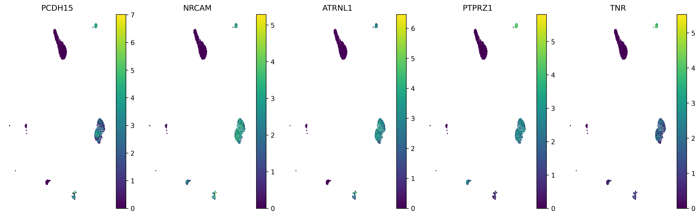
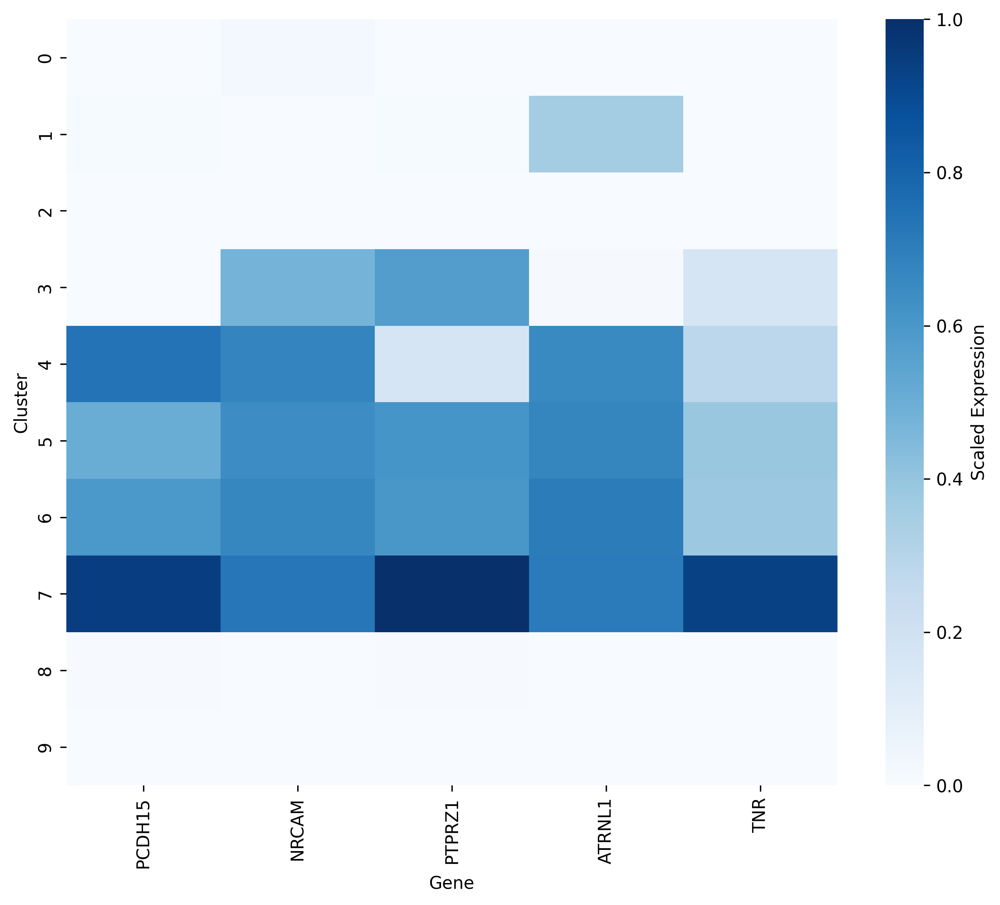
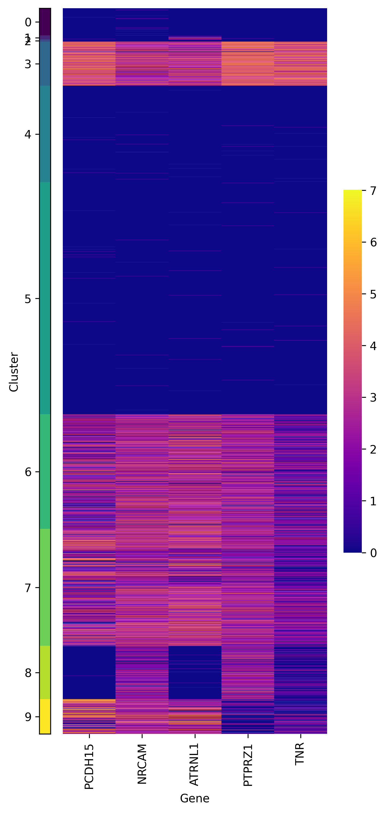
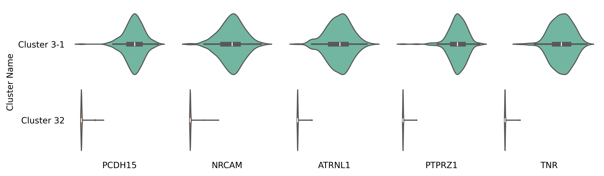

Visualization on Marker Gene
====================================================

This dataset contains 4,714 cells from the **Red Nucleus** region of the human midbrain, as part of the **Human Brain Cell Atlas**. For more details, refer to the `description <https://cellxgene.cziscience.com/e/470565f2-5afc-456a-b617-18e4496c04fd.cxg/>`_. It is available for free download in **h5ad** format from the **CELLxGENE** website via this link: `Download Link <https://datasets.cellxgene.cziscience.com/5488ff72-58ed-4f0d-913c-1b6d4d8412b1.h5ad>`_.

Hierarchical Clustering of the Data
--------------------------------------------------

.. code-block:: python

    import requests
    import anndata
    import CellScope
    from scipy.sparse import issparse
    import numpy as np
    url = "https://datasets.cellxgene.cziscience.com/5488ff72-58ed-4f0d-913c-1b6d4d8412b1.h5ad"
    file_path = "Siletti-1.h5ad"
    response = requests.get(url, stream=True)
    if response.status_code == 200:
        with open(file_path, "wb") as f:
            for chunk in response.iter_content(chunk_size=8192):
                f.write(chunk)
    adata = anndata.read_h5ad("Siletti-1.h5ad")
    fea_raw = adata.X
    cell_types = adata.obs['cell_type']
    Gene_Name = adata.var['feature_name']
    label = np.array(cell_types)
    fea_raw,fea_log,fea = CellScope.cs.Normalization(fea_raw)
    fea_Fitting_1, Signal_Space, Center_index = CellScope.cs.Manifold_Fitting_1(fea)
    if issparse(fea_Fitting_1):
        fea_Fitting_1 = fea_Fitting_1.toarray()
    fea_Fitting_2, fitting_index, index_after_outlier_removal = CellScope.cs.Manifold_Fitting_2(fea_Fitting_1)
    T_all_1 = CellScope.cs.GraphCluster(fea_Fitting_1)
    T_all_2 = CellScope.cs.GraphCluster(fea_Fitting_2)
    Y_1 = CellScope.cs.Visualization(fea_Fitting_1)
    Y_2 = CellScope.cs.Visualization(fea_Fitting_2)

Identify the marker genes for Cluster 3-1 and Cluster 3-2
---------------------------------------------------------

.. code-block:: python

    Y_initial, label_step0, Y_1, Title_1, Y_all, Title_all, index_1, index_all, step0, step1 = CellScope.ts.generate_tree_structured(fea_Fitting_1, T_all_1, step0 = None, step1 = 8)
    cluster1 = index_all[2]
    cluster2 = index_all[3]
    label = T_all_1[:,8]
    marker_gene_indices,_ = CellScope.fm.FindMarker(fea_log, cluster1, cluster2, selected_number = 5, selected_method = 'diff pct')
    marker_gene_name = np.array(Gene_Name[marker_gene_indices])

CellScope offers various visualization methods for marker genes

Color the visualization results using the expression levels of the marker genes
------------------------------------------------------------------------------------------------------------------

.. code-block:: python

    CellScope.gev.scatter_gene_expression(fea_log,Y_initial,marker_gene_indices,marker_gene_name,figsize=(15, 9), subplot_size = None, 
                            save_fig=False, save_path=None)

Plot the mean expression heatmap of genes across different cell groups
------------------------------------------------------------------------------------------------------------------

.. code-block:: python

    CellScope.gev.plot_mean_expression_heatmap(fea_log, marker_gene_indices,marker_gene_name, label)

Plot the expression heatmap of marker genes across different cell types
------------------------------------------------------------------------------------------------------------------

.. code-block:: python

    CellScope.gev.plot_clustered_heatmap(fea_log, marker_gene_indices, marker_gene_name, 
                           label, save_fig=False, save_path=None)

Plot violin plots to compare the expression levels of marker genes between different classes
------------------------------------------------------------------------------------------------------------------

.. code-block:: python

    CellScope.gev.compare_violin_plot_between_classes(fea_log, marker_gene_indices, marker_gene_name, 
                                        cluster1, cluster2, class_name=['Cluster 3-1', 'Cluster 3-2'], 
                                        figsize=(10, 3), save_fig=False, save_path=None)

