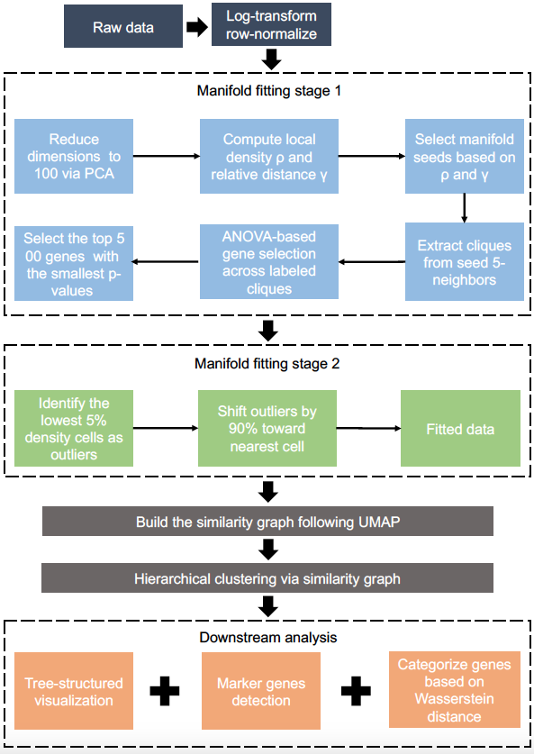

.. CellScope documentation master file, created by
   sphinx-quickstart on Tue Oct 15 09:46:10 2024.
   You can adapt this file completely to your liking, but it should at least
   contain the root `toctree` directive.

CellScope: High-Performance Cell Atlas Analysis with Tree-Structured Representation
======================================

CellScope is an efficient toolkit for analyzing single-cell gene expression data, and its specific workflow is illustrated as follows. It integrates features such as gene selection and denoising through two-step manifold fitting, clustering and visualization, differential gene identification and plotting, and multi-scale, high-resolution cellular atlas construction. Compared to traditional methods, CellScope demonstrates superior performance across diverse single-cell datasets, significantly improving clustering accuracy and visualization clarity, enhancing computational efficiency, while reducing hyperparameter dependency and increasing algorithm interpretability. For any inquiries or suggestions, please contact thni@zju.edu.cn.

.. toctree::
   :maxdepth: 2
   :caption: Contents:

   Installation
   Tutorials  
   API
   Contributions and Feature Requests
   References

